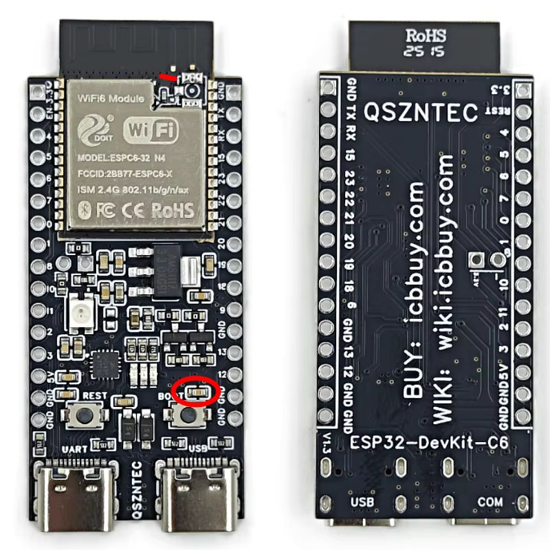
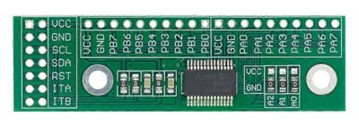
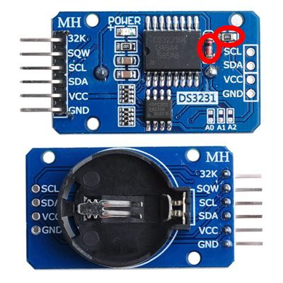
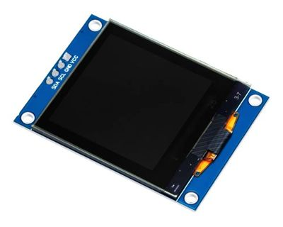
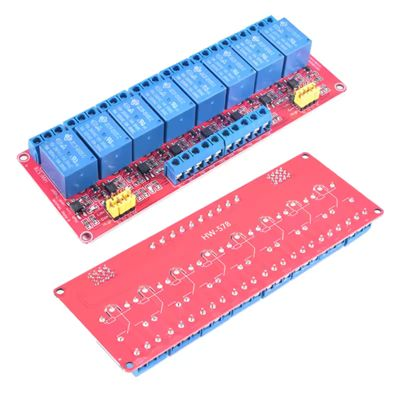
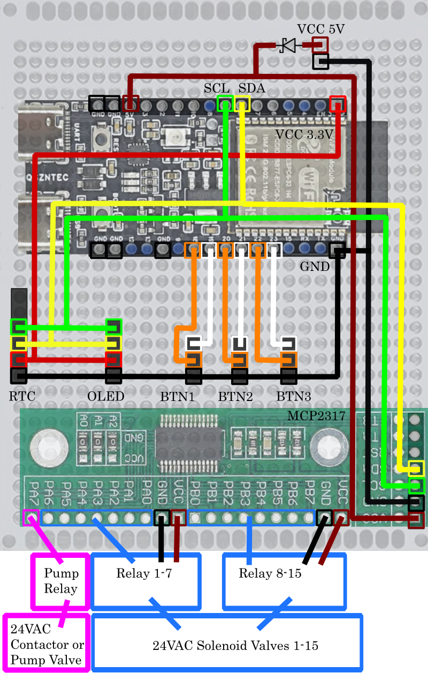

## Hardware Build

### Parts list

#### ESP32-C6 DevKitC-1

- Prototype built using ESP32-C6-N4-U1 devkit.
- Hardware quirks: 
	- Depending on manufacturing batch the debouncing capacitor above the boot button may pull GPIO9 into bootloader mode on cold start. Fix: remove the capacitor marked red.
	- The built-in wireless antenna is usable. If you need external antenna for better reception there's a pad for soldering an IPX-1 connector, but the capacitor used for antenna selection is in a hard to reach spot without hot-air station and steady hands. 
	- Recommendation: cut trace at red mark, use jumper wire to connect to IPX nipple
- Check the pins of your board, not all DevkitC1 comes with this pin layout. There are 30 and 32 pin variants released. 
- Potential alternative: Seeed Studio [XIAO ESP32C6](https://wiki.seeedstudio.com/xiao_esp32c6_getting_started/); Untested firmware configuration added as compile time substitution with configured external antenna. Limitation: No RGB led on board.
- The project is tested on ESP32-C6, however, in theory it's also compatible with all ESP32 models containing 802.15.4 radio.

#### MCP23017 I/O expander

- can drive up-to 16 relays
- adjust pins in `\zones\relays_#.yaml` if you use different I/O expander
- use expander board, or solder SPDIP-28 MCP23017 I2C chip onto the perfboard
- all pins are outputs, interrupt pins not connected

#### DS3231 Real time clock module 

- Hardware quirks: this module has a useless/dangerous charging feature that can cause non-rechargeble lithium batteries to explode if used with 5V VCC. Recommend removing the 200 Ohm resistor and/or the diode between the battery and VCC. Using an unmodified board on 3.3V supply voltage _should be_ safe, but not recommended.
- 32K and SQW pins unused

#### SH1107 128×128 OLED

- Firmware is configured for I2C interface

#### Relay boards

- 5V high trigger relay boards with built-in octo coupler to reduce EM interference to the microcontroller

#### Miscelanious

- Perf board: recommended 150 x 100 mm
- 3 momentary buttons with built in led, 16+ mm diameter
- DuPont connectors, headers, sockets, wires
- USB socket for VCC, Schottky diode for reverse protection , 1A fuse recommended
- Measured peak current ~180 mA/5V
- Project box. [OH-4](https://onninen.pl/en/product/ELEKTRO-PLAST-OPATOWEK-Hermetic-enclosure-IP65-OH-4-A4-29-44,93295) used for prototype 8 + 4 relay configuration
- Busbar to connect one side of the 24VAC circuit
- Optional: 24 VAC trigger side contactor with adequate AC-7b rating [More info](https://viox.com/ac-7a-vs-ac-7b-modular-contactor-failure-motor-loads/)

### Wiring Example

