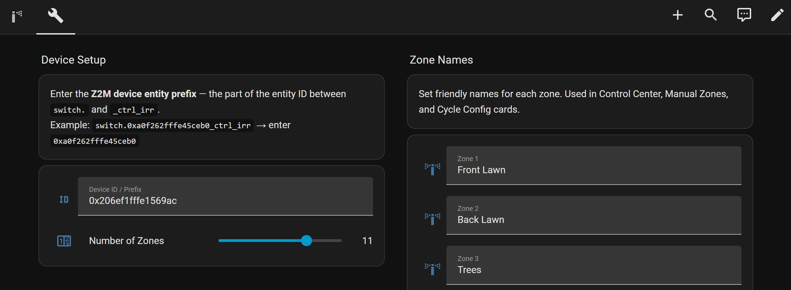
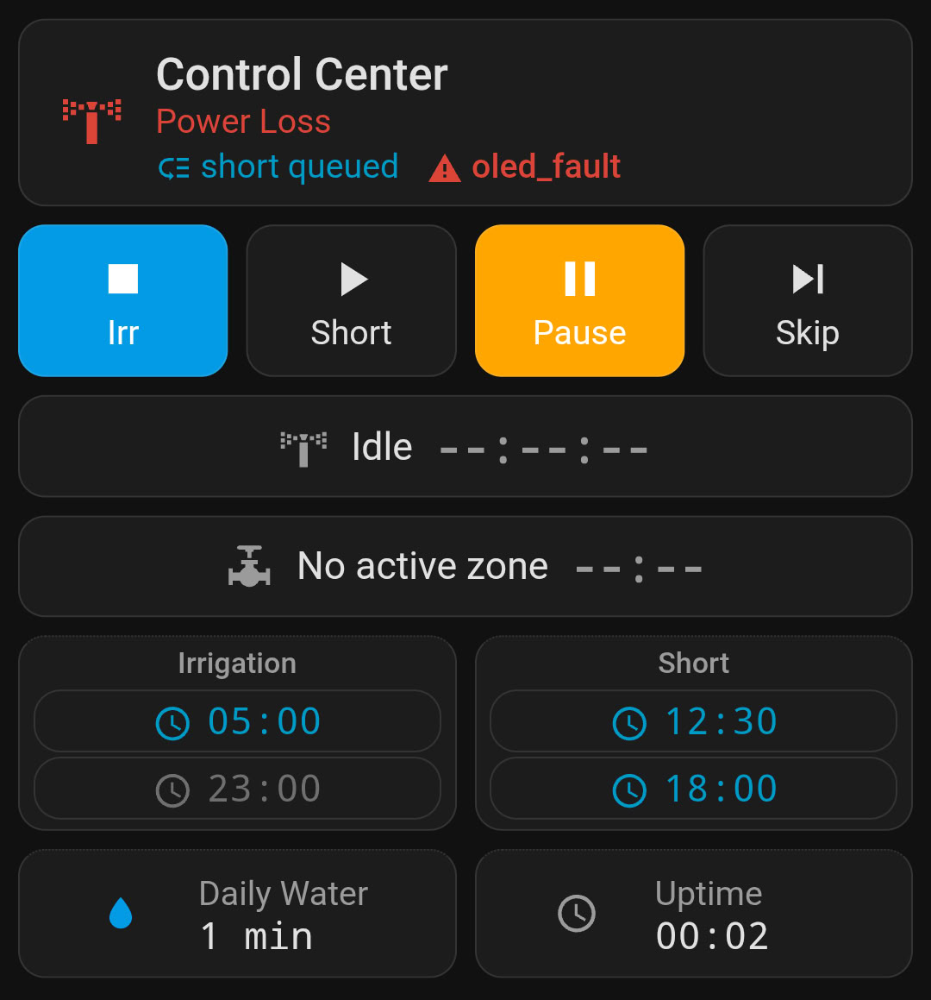
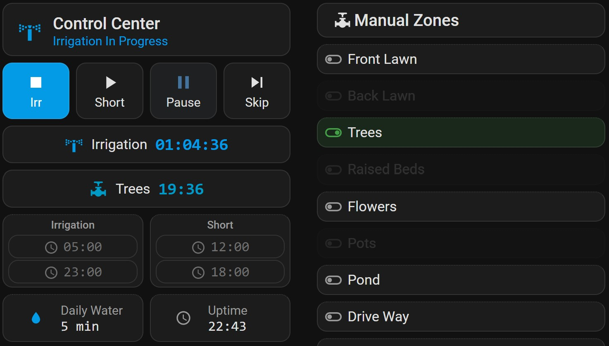
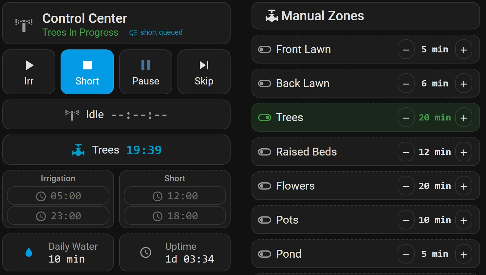
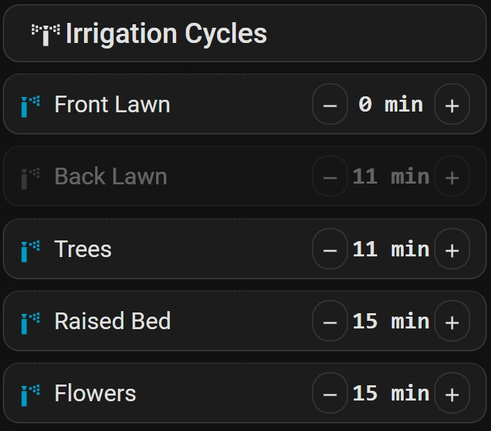
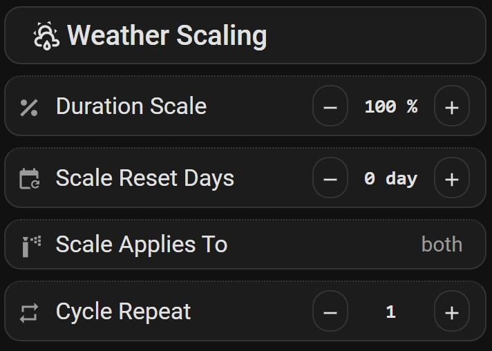
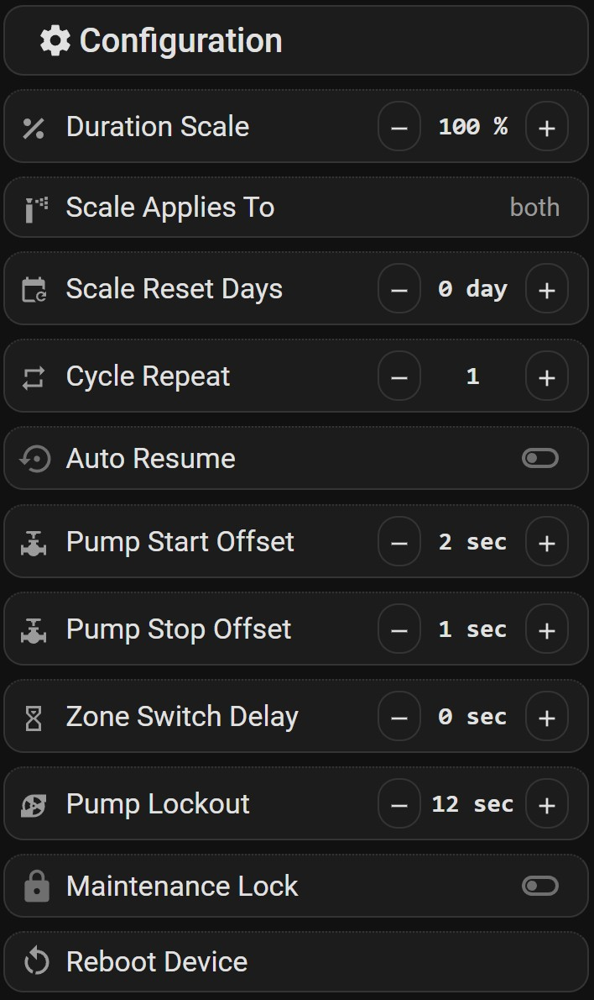

# Home Assistant Dashboard

## Installation

1. Copy `irrigation_control_z2m_converter.mjs` to Zigbee2Mqtt `external_converters/` directory, pair the device and verify it's [exposed](#zigbee2mqtt%20control) to HA
2. Use HACS to install the `button-card` extension 
3. Copy `irrigation_dashboard_helpers` to your HA config folder, open `configuration.yaml` and add the following:

```yaml
# configuration.yaml
homeassistant:
  packages:
    irrigation: !include irrigation_dashboard_helpers.yaml
```

4. Reboot Home Assistant
5.  Settings → Dashboards → Add Dashboard → select "New dashboard from scratch" → Open, Edit, select "Raw configuration editor" → Paste the contents of `irrigation_dashboard.yaml`
6. Open the dashboard → **Config** tab → Setup your device 
7. Switch to the **Dashboard** tab. and configure cards as needed.

---
## Dashboard Layout

### Config Tab



- Set **Device ID** to your Z2M device entity prefix. Examples: "0xa0f262fffe45ceb0" (IEEE address, default) or "irrigation_controller" if you renamed the device in Z2M
- Set **Number of Zones** to match your firmware
- Set the **Zone Names** displayed in the Dashboard

### Dashboard tab

#### Control Center 



- Shows `Start`/`Stop`/`Pause`/`Skip` forward buttons for cycle management, cycle and zone runtime sensors, schedules configuration, daily water/uptime sensors and queue/power loss/fault status in the statusbar at the top.
- Tapping any of the schedule entries enables/disables them. To edit the timers tap-hold the button.
- In case of a power out the device will offer to run interrupted or missed cycles from the same day. These pending cycles can be resumed with the `Pause` button, aborted with the highlighted `Cycle button`, or overwritten with the inactive `Cycle button`. A scheduled start will also overwrite the pending cycle start to prevent blocking the device with stale runs. If the `Auto resume` option is turned on in Configuration the cycles will autostart on boot without waiting for user interaction. [More](docs/Specification.md#power%20loss%20recovery)



- While a `Cycle` is active the `Manual Zones` cards do double duty as `skip to zone` button. Tap on a card in the stack, and the cycle skips over any zones in between. You can only skip forward, and only to zones that are enabled in the active `Cycle`'s configuration and have longer `Duration` than 0. Invalid zones are dimmed while a `Cycle` is active. 
- While a `Cycle` is active a different type can be queued to run after it finishes. A scheduled cycle automatically puts itself into the queue if the device is busy, so overlapping timers or manual cycle triggers don't block schedules. 

#### Manual Zones



- Manual zones can be started and stopped from the `Manual Zones` card stack when the device is Idle by tapping on the card. 
- A manual zone ends either when it's timer runs out, it's a stopped by tapping its card, or by starting a different zone by tapping any other zone card. This will abort the currently selected zone and start a new one immediately. Valve offsets are not respected while hot-swapping  between manual zones.  
- Zone duration can be set by tapping the +- icons, holding the +- icons for hold-repeat input, or tap-holding the card and adjusting the slider in the pop-up. 
- The duration needs to set before starting a zone, adjusting during runtime has no effect.
- Starting a Cycle while a manual zone is active will put it into the queue. Scheduled Cycles are automatically queued while a device is running a manual zone. When the last manual zone finishes the queue content is started automatically. It's possible to postpone the queued Cycle start by hot-swapping to a different zone. 

#### Cycle configuration



- Tap on a card to add/remove the zone to a cycle. Disabled cards are shown dimmed.
- Adjust zone duration by tapping the +- icons, holding the icons for hold-repeat input, or holding on the card and adjusting the slider in the pop-up.
- A cycle will run a zone if it's enabled AND the duration is set longer than 0 minutes.

#### Weather Scaling


##### Seasonal & Weather scaling:
- **Duration Scale** - multiplier applied to cycle durations (10–200% in 10% steps, or 0 to disable)
- **Scale Reset days** - number of days over which the scale returns to 100%. The scale percentage linearly regresses towards 100% each midnight until it resets to baseline. Eg: 20% over 3 days will play out as: 20% → 40% → 70% → 100%. 
- **Scale applies to** - which cycles the scale applies to: irrigation only, short only, or both. 
- **Cycle Repeat** - number of passes per cycle (1, 2, or 3)

Use these settings to dynamically adjust water needs based on weather or soil conditions. You can set up an automation in HA that adjusts `Duration Scale` and `Reset days` when a weather service reports rain to reduce watering for a set amount of days that auto resets.  For seasonal adjustments use `Duration Scale` with `Scale Reset days = 0` to set a permanent scaling factor. If soil absorption is an issue, using `Repeat` 2 with `Duration Scale` 50% helps deliver the same amount of water while giving a longer time for water to seep into the ground.

#### Configuration


##### Valve timings:
- **Pump start offset** - seconds between valve opening and pump start. (positive = valve first; negative = pump first) Value: +5 to -5
- **Pump stop offset** - seconds between pump stop and valve close. (positive = pump first; negative = valve first) Value: +5 to -5
- **Zone switch delay** - gap between closing one zone and opening the next. Value: 0-5

 Setting positive offsets will lead to low pressure valve starts, while negative offsets will operate the valves in a high pressure environment by starting the pump first, and keeping it on while the valve closes. Choose the setting that fits your system.  
##### System settings:
- **Maintenance lock** - blocks all cycle starts
- **Auto resume** - automatically start/restart interrupted or missed cycles after power-loss
- **Pump lockout** - mandatory wait after cycle end (0–30 s)
- **Reboot device**

---

## Zigbee2MQTT Control

Once paired and the converter is loaded, the device exposes:

### Switches (`switch.*`)

- `ctrl_irr` - start/abort irrigation cycle
- `ctrl_short` - start/abort short cycle
- `ctrl_skip` - skip to next zone
- `ctrl_zone_NN` (one per zone) - manual zone start or skip to any zone while a cycle is running 
- `ctrl_pause` - pause/resume any running cycle
- `cycle_irr_zone_NN_enable`, `cycle_short_zone_NN_enable` - zone enable flags
- `cycle_irr_schedule_N_enable`, `cycle_short_schedule_N_enable` - schedule enable flags
- `zb_auto_resume` - 
- `zb_maintenance_lock` -
- `zb_reboot` -

### Numbers (`number.*`)

- `cycle_irr_zone_NN_duration`, `cycle_short_zone_NN_duration` - minutes per zone per cycle
- `manual_zone_NN_duration` - manual mode duration per zone
- `cycle_irr_schedule_N_time`, `cycle_short_schedule_N_time` - schedule hour:minute
- `zb_duration_scale`, `zb_scale_enable`, `zb_scale_reset_days`, `zb_cycle_repeat` - weather scaling
- `zb_pump_lockout` - pump lockout timing
- `zb_pump_start_offset`, `zb_pump_stop_offset`, `zb_zone_switch_delay`- pump/valve timing

### Sensors (`sensor.*`, `binary_sensor.*`)

- `status_cycle_state` - none / irrigation / short
- `status_queue_state` - none / irrigation / short
- `status_active_zone` - currently running zone number
- `status_cycle_remaining`, `status_zone_remaining` - countdowns
- `status_daily_water` - time watered today (min.)
- `status_pump_lockout` - transient indicator that cycle start is temporally blocked
- `status_power_loss` - indicator that the device lost power, a cycle was recovered from the downtime period, and user input is needed. Cleared by abort, resume, autoresume or next scheduled cycle
- `status_fault` - hardware fault indicator. Check device.
- `status_uptime` - device heartbeat, updated every minute

### Selects (`select.*`)

- `zb_scale_enable` - irr / short / both

Most exposes update on change and are pushed unsolicited. Home Assistant automations can subscribe to any of the exposed attributes. Timers are pushed periodically to reduce Zigbee traffic. Zone/Cycle countdowns are only active while a zone is active, and run on a 10s interval, the uptime sensor is pushed on a 1min interval. 

---
## ZHA support

The device has not been tested with ZHA, and is not supported.

In theory a firmware with maximum 14 zones could be operated in a limited mode using ZHA out of the box, as the Zone switches and the Cycle switches are standard Zigbee clusters that should be autodetected by ZHA after pairing. For more zones the firmware would likely need to be compiled with increased binding table size, see B11 in [TODO list](docs/TODO%20list.md) for the external component change. 

However custom clusters would need ZHA support to be loaded, and Zigbee time sync is not available on ZHA as of this moment. This means most device configuration would need to be done on the device UI.