# User Guide

This guide covers everyday operation of the irrigation controller - running cycles, manual zone control, configuring schedules, and recovering from power loss. Both local (OLED + buttons) and Home Assistant control are covered.

## Table of Contents

1. [Overview](#overview)
2. [Buttons and Display](#buttons%20and%20display)
3. [Idle Screen](#idle%20screen)
4. [Cycle Types](#cycle%20types)
5. [Running a Cycle](#running%20a%20cycle)
6. [Manual Zone Mode](#manual%20zone%20mode)
7. [Pause and Resume](#pause%20and%20resume)
8. [Power Loss Recovery](#power%20loss%20recovery)
9. [Pump Lockout](#pump%20lockout)
10. [Settings Menu](#settings%20menu)
11. [Maintenance Lock](#maintenance%20lock)
12. [Fault Pages](#fault%20pages)
13. [Screensaver and Night Mode](#screensaver%20and%20night%20mode)
14. [LED Indicators](#led%20indicators)

---

## Overview

The controller manages individual irrigation zones (typically one zone = one solenoid valve = one section of garden) and a central pump. It supports three operating modes:

- **Irrigation cycle** - long watering run designed to run through all enabled zones
- **Short cycle** - shorter watering run for zones that need extra watering
- **Manual zone** - open a single zone for a custom duration

All modes can be started locally with the buttons or remotely via Home Assistant. Configuration (schedules, durations, scaling) is fully editable from either interface. Both cycle types can be scheduled up to two times per day on the controller, or triggered remotely from HA, or any home automation system that supports Z2M. Manual zones can't be scheduled, but can be started on the controller or triggered remotely. If need, you can set up a HA automation to schedule manual zones.  

---

## Buttons and Display

Three buttons on the device front panel:

| Button | Position | General role                               |
| ------ | -------- | ------------------------------------------ |
| **B1** | Left     | Confirm / start / abort / enter menus      |
| **B2** | Middle   | Navigate left / decrement / pause          |
| **B3** | Right    | Navigate right / increment / skip / resume |

The function of each button depends on the current page. The bottom of every page shows the relevant actions.

Button gestures:

- **Short press** - tap and release (≤ 1 second), Led confirm by blinking OFF
- **Medium press** - hold for ~1 second; LED confirms by turning back ON
- **Long press** - hold for ~5 seconds; LED pulses to confirm

---

## Idle Screen

The default page when no cycle is running.

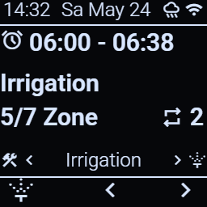

What it shows:

- **Top bar** - current time and date, status icon and network status
- **Main** - Next schedule time , next cycle name, zone configuration repeat indicator (1–3 passes), queue indicator if a cycle is waiting
- **Navbar** - Shows currently selected action/page 
- **Footer** - Button labels, B1 enters, B2/B3 cycles through the possible actions

From idle:

- **B1 short** - enter selected page or start the cycle shown in the navbar (irrigation or short)
- **B2 / B3** - switch between page options

---

## Cycle Types

### Irrigation Cycle (long watering)

- Runs through every zone with the "irrigation enabled" flag set
- Uses each zone's irrigation duration
- Set up to run up to twice daily, default one schedule per day 
- Has the higher priority in case of running missed cycles after extended powerloss

### Short Cycle (light watering)

- Runs through every zone with the "short enabled" flag set
- Uses each zone's short duration
- Can fire up to two daily schedules

Each cycle type has independent zone durations and independent enable flags. A zone can be in the irrigation cycle, the short cycle, both, or neither.

---

## Running a Cycle

### Starting

- **Locally**: Idle screen → make sure the navbar shows the cycle type you want → **B1 short press**
- **Home Assistant**: turn on the `Ctrl Irr` or `Ctrl Short` switch

### Running screen

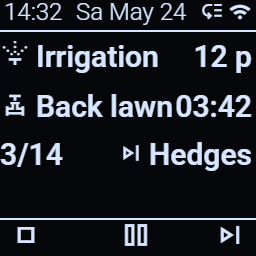

Shows:

- Active cycle and remaining time in minutes
- Current zone name and remaining time mm:ss format 
- Zone progress indicator with the total accounting for cycle repeats
- Next zone name, shows stop or queue icon on last zone

Button actions while running:

- **B1 short** - abort cycle
- **B2 short** - pause cycle
- **B3 short** - skip to next zone

### Cycle queue

If you start a second cycle while a manual zone or a cycle is already running, it goes into a **queue** and starts automatically when the active cycle finishes (after the pump lockout completes). Only one cycle can be queued at a time - starting a third cycle replaces nothing if it's the same type, or follows the queue rules in [the spec](Specification.md#cycle-queue). Adding cycles to queue is only possible remotely. Scheduled cycles automatically go into the queue if the device is busy running a manual zone or a different cycle.

The queue is shown on the idle screen with a small indicator.

---

## Manual Zone Mode

Use this to run a single zone for a custom duration - for testing, hand watering, or maintenance tasks.

### Entering manual mode

- **Locally**: Idle screen → **B1 short press**
- **Home Assistant**: turn on any individual `ctrl_zone_NN` switch while the device is idle. While a cycle is running on the device the `ctrl_zone_NN` switches can be used as a skip to zone button.

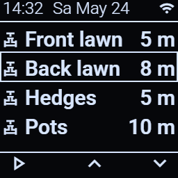

The zone list scrolls with B2/B3. Press B1 to start the highlighted zone.

### While a manual zone runs

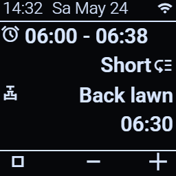

- **B1 short** - stop manual zone
- **B2 short** - decrement runtime, hold button for 1s holdrepeat value input 
- **B3 short** - increment runtime, hold button for 1s holdrepeat value input

Manual zone durations are **never affected by the weather scale** setting - what you set is what you get. Incrementing or decrementing a value saves it as the new duration for next run. A cycle triggered from HA or by a schedule while a manual zone is active gets added to the queue and starts immediately after the zone ends.

---

## Pause and Resume

A running cycle can be paused. The current zone closes, the pump stops, and the device shows the pause page.

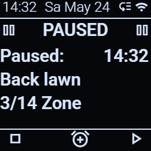

From the pause page:

- **B1 short** - abort the cycle entirely
- **B2 short** - enter pause-timer input (auto-resume after N minutes)
- **B3 short** - resume immediately

The pause timer is optional. Leave it at zero for an indefinite pause; the cycle waits until you press B3.

From Home Assistant: toggle the `Pause` switch. Turning it on pauses any running cycle; turning it off resumes.

---

## Power Loss Recovery

If power is lost during a cycle, or if the device misses a scheduled cycle while powered off, the controller detects this at boot.

### What gets detected

At boot, the device checks:

1. Was a cycle running when power was lost? → mark as **interrupted**, resume from beginninng of interrupted zone
2. Did one or more scheduled cycle fire while the device was off? → mark as **missed**
3. Was a cycle queued behind the interrupted one? → preserve it

A decision tree combines these signals and produces a single "pending cycle" plus an optional "queued cycle." Both survive across the reboot.

### Pending cycle page

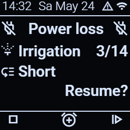

Shows the cycle type, the zone it would start from, and any queued cycle. From this page:

- **B1 short** - discard the pending cycle (and queue) entirely
- **B2 short** - enter a timer (auto-resume after N minutes)
- **B3 short** - resume immediately

If auto-resume is off the recovered cycle(s) will wait for user input. These cycles can be resumed on the device with B3, or by the Ctrl_pause button in Z2M/HA. A pending cycle will not block scheduled cycles, it will be dropped and running the schedule takes priority.

### Auto-resume

If you don't want to confirm power-loss recovery manually, enable **Auto-resume on power loss** in Settings → System. The pending cycle then starts automatically at boot, skipping the confirmation page. The same setting can be toggled from Home Assistant via the `Auto resume` switch.

A safety feature is implemented to prevent a low probability runaway condition where recurring reboots/powerlosses prevent the device from finishing a zone leading to overwaters. After 3 powerlosses are detected in the same zone the device skips to the next zone. 

### Missed schedules

The device only considers schedules that would have fired **after midnight of the current day**. A schedule missed two days ago is not run retroactively.

---

## Pump Lockout

After any cycle ends (normal completion or abort), the pump enters a mandatory **lockout** period. This protects the pump from rapid restarts.

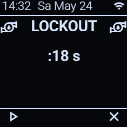

During lockout:

- No cycles can start (manual zones or scheduled or queued)
- The countdown runs in the background, but is shown on screen if cyle start is attempted. The board RGB is red while lockout is active.
- Any queued cycle starts automatically when lockout ends

Lockout duration is configurable in Settings → System.

---

## Settings Menu

Enter the settings menu from the idle screen by selecting it with B2/B3 and pushing B1.

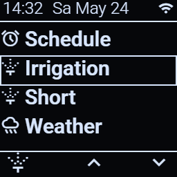

Navigate with B2/B3, confirm with B1 short. Enter editing mode on a settings value by pressing B1, change values with B2/B3. Hold B2/B3 to increase input speed (holdrepeat mode). Confirm new value with B1 short. Exit any subpage and return to main settings or idle page with **B1 medium press**. Exiting a subpage automatically saves all values on that page to NVS and sends update to the Zigbee coordinator.

### Schedule (Sched)

Configure up to four daily schedules: two irrigation, two short cycles.

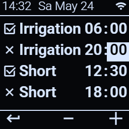

Each row: enable flag, hour, minute. The firmware comes with one Irrigation and two short cycled enabled. Default start times are 5:00 and 23:00 for `Irrigation` cycles, 12:00 and 18:00 for `Short` cycles. The 23:00 schedule is disabled as default.

### Irrigation zones (Irr)

Per-zone irrigation duration and enable flag.

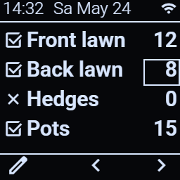

Default durations in the firmware are 15 minutes for `Irrigation` zones and 10 mintues for `Short` zones. A zone with duration > 0 and the enable flag set will run when a cycle is triggered.

### Short zones (Short)

Same as above, but for the short cycle.

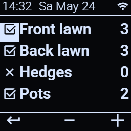

### Weather / Seasonal scale

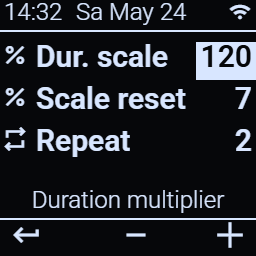

- **Scale %** - multiplier applied to cycle durations (10–200% in 10% steps, or 0 to disable)
- **Reset days** - number of days over which the scale auto-returns to 100% (0 to disable auto-reset) 
- **Repeat** - number of passes per cycle (1, 2, or 3)
- **Scale enable** - which cycles the scale applies to: irrigation only (1), short only (2), or both (3) 
- The scale percentage linearly regresses towards 100% each midnight until it resets to baseline. Eg: 20% over 3 days will play out as: 20%>40%>70%>100%
- Use these settings to dynamically adjust water needs based on weather or soil conditions. You can set up an automation that adjusts `Scale%` and `Reset days` when a weather card reports rain to reduce watering for a set amount of days that auto resets. 
- If soil absorption is an issue, using `Repeat` 2 with `Scale%` 50% helps deliver the same amount of water while giving a longer time for water to seep into the ground.
- For seasonal adjustments use `Scale%` without `Reset days` to set a permanent scaling factor.

Manual zones are **never scaled.**

### Valve / pump timing

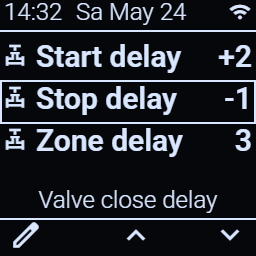

- **Pump start offset** - seconds between valve opening and pump start. (positive = valve first; negative = pump first) Value: +5 to -5, default: 2
- **Pump stop offset** - seconds between pump stop and valve close. (positive = pump first; negative = valve first) Value: +5 to -5, default: 1
- **Zone switch delay** - gap between closing one zone and opening the next. Value: 0-5, default: 0
- Setting positive offsets will lead to low pressure valve starts, while negative offsets will operate the valves in a high pressure environment by starting the pump first, and keeping it on while the valve closes. Choose the setting that fits your system. Default value is 2s start offset and 1s stop offset.
- Zone switch delay is for systems that need high pressures for valves movement. 
- System security design prevents two zone valves from opening at the same time, so valve overlap for low pressure systems is not implemented.

### System (Advanced)

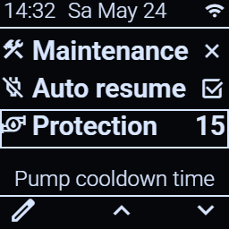

- **Maintenance lock** - blocks all cycle starts (see below)
- **Auto resume** - automatically start/restart interrupted or missed cycles after power-loss
- **Pump lockout** - mandatory wait after cycle end (0–30 s)

### Display (OLED)

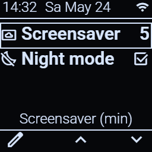

- **Display timeout** - minutes before screensaver activates. default: 5 min (0 disables screensaver)
- **Night off** - disable display entirely during configured night hours. Hours can be configured at compile time in `config.h`

### Date and time

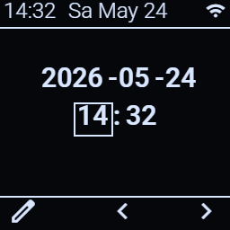

Manually set the date and time. Use this for initial setup or if RTC sync is unavailable. Normally the device gets time from Zigbee on first connect and stores it in the DS3231 RTC battery-backed clock - manual entry is rarely needed.

---

## Maintenance Lock

When you need to work on the irrigation system (replacing a valve, fixing a leak), enable **Maintenance lock**. While it's on:

- No cycle can start, from any source - local, schedule, or Home Assistant
- Manual zones are also blocked
- The RGB LED stays on a distinctive colour to signal the lock

Enable it from Settings → System → Maintenance lock, or from Home Assistant via the `Maintenance lock` switch.

The lock persists across reboots until you explicitly turn it off - power-cycling will not clear it.

---

## Fault Pages

The controller monitors several hardware components and shows a fault page if something is wrong. I/O fault and maintenance lock block normal operation of the device, and prevent zone/pump starts. The device can be used with other fault.

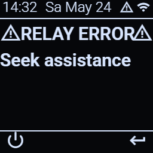

Possible conditions:

- **I/O fault** - MCP23017 expander not responding. (relays cannot be controlled)
- **RTC fault** - DS3231 not responding.
- **RTC battery low** - DS3231 backup battery flat (time will be lost on power loss). Condition only detected on cold starts, not on reboot.
- **OLED fault** - display not responding (fault logged to Z2M/HA)
- **Maintenance lock active** - shown as a fault-style page when triggered

`I/O fault` and `Maintenance` conditions block all zone and cycle starts. Operation of the controller is possible under the other fault conditions with diminished funcionality. 

Buttons on fault pages:

- **B1** - reboot (clears transient faults if the cause is gone)
- **B2** - context-specific (set date/time for RTC fault; toggle maintenance off for maintenance fault)
- **B3** - dismiss the page and return to idle (the fault remains; just stops showing the page)

---

## Screensaver and Night Mode

To prevent OLED burn-in, the display goes into a screensaver mode after the configured timeout.

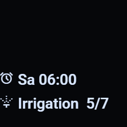

The screensaver cycles through three views: schedule, clock, and (if any) fault summary.

If you've enabled **Night off**, the display turns off entirely during night hours (configured in `config.h`). Any button press wakes it.

A running cycle always keeps the display on at full brightness, regardless of timeout. Default brightness levels can also be configured in `config.h`.

---

## LED Indicators

The WS2812 RGB LED on the front shows the device's overall state at a glance:

| LED | Meaning |
|---|---|
| **Solid blue** | Idle |
| **Solid green** | Pump running |
| **Blinking green** (2 s on/off) | Cycle paused |
| **Solid red** | Pump lockout |
| **Green/blue alternating** (2 s) | Power loss page active - awaiting confirmation |
| **Blinking red** (2 s on/off) | Fault page active |

The three button LEDs serve as button highlight + activity feedback:

- All on by default
- Brief off-pulse when you press a button (acknowledges the press)
- On after 1s press to indicate mediumpress/hold repeat in value edit mode in settings
- Sequential animation at cycle start, cycle end, and zone transitions

---

## Tips and Gotchas

- **Time sync is delayed at first boot.** The device needs Zigbee to be paired and connected before it can get the current time. After first sync, the DS3231 RTC keeps time across power loss (with battery).
- **Auto-resume is off by default.** If you don't want to confirm at the device after a power loss, turn it on in Settings → System.
- **Manual zones are unscaled.** The seasonal/weather scaling only affects cycle durations, never manual runtime.
- **Maintenance lock persists.** Rebooting will not clear it - you must turn it off explicitly.
- **One queue slot.** Only one cycle can be queued behind a running one. Starting a third cycle while one is running and one is queued does not extend the queue.
- **Cycle "repeat" restarts the whole cycle again.** Repeat = 2 means every enabled zone runs twice; not that each zone runs for 2× its duration.